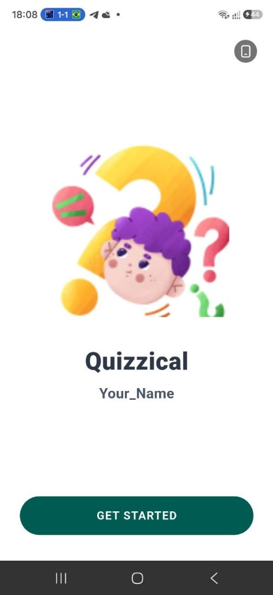
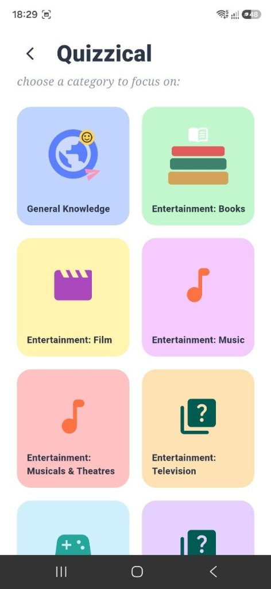
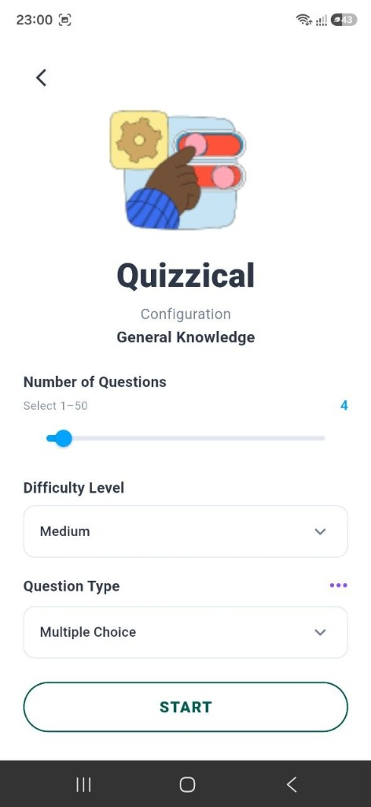
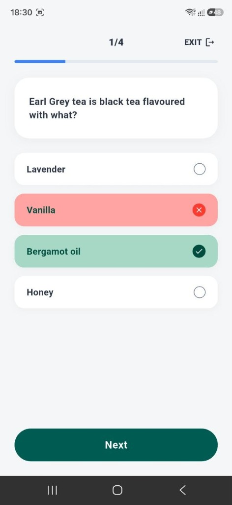
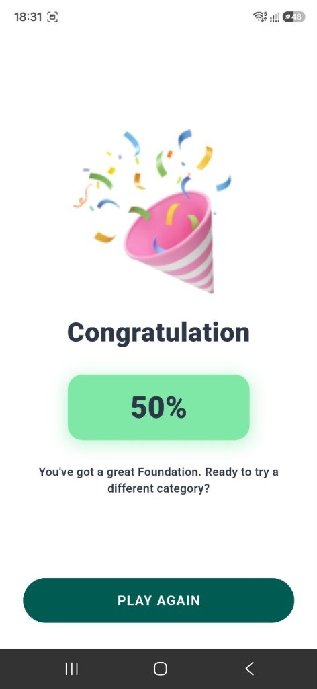

# 🧠 Quizzical - Flutter Quiz Application

**Quizzical** is a modern, responsive, and feature-rich Flutter quiz application built for the **CSE App Development Lab Exam**. It dynamically fetches real-time trivia questions from the [Open Trivia Database (OpenTDB) API](https://opentdb.com/) using **Provider** state management and follows clean architecture principles.

---

## 📸 Demonstration

| Welcome Screen | Category Selection | Quiz Configuration |
| :---: | :---: | :---: |
|  |  |  |

| Live Quiz Screen | Results & Performance |
| :---: | :---: |
|  |  |

---

## ✨ Features

- **👋 Welcome & User Branding**: Personalized greeting screen featuring student name (**Israt Jahan Tamanna**) with quick start action.
- **📚 Dynamic Quiz Categories**: Fetches live trivia categories dynamically from OpenTDB API with custom UI icons and fallback offline safety.
- **⚙️ Customizable Quiz Setup**: 
  - Choose number of questions (1 to 50 questions).
  - Select difficulty level (*Any, Easy, Medium, Hard*).
  - Select question type (*Any, Multiple Choice, True / False*).
- **⏱️ Interactive Quiz Experience**:
  - Animated countdown timer per question.
  - Immediate visual feedback on answer selection (green for correct, red for incorrect with correct option highlighted).
  - Smooth progress indicator showing current question index.
- **📊 Comprehensive Results & Performance Analytics**:
  - Final score breakdown and accuracy percentage calculation.
  - Interactive options to **Play Again** with same settings or **Choose Another Category**.
- **📱 Responsive & Accessible UI**: Responsive layout tailored for mobile devices, supporting dark/light contrast standards and clean typography.

---

## 🛠️ Tech Stack & Packages

- **Framework**: [Flutter SDK](https://flutter.dev/) (Dart)
- **State Management**: [`provider`](https://pub.dev/packages/provider)
- **HTTP Client**: [`http`](https://pub.dev/packages/http)
- **HTML Decoding**: [`html_unescape`](https://pub.dev/packages/html_unescape)
- **Local Persistence**: [`shared_preferences`](https://pub.dev/packages/shared_preferences)
- **API Source**: [OpenTDB REST API](https://opentdb.com/api_config.php)

---

## 📁 Project Architecture & Structure

The codebase follows **Clean Architecture** guidelines, maintaining clear separation of concerns across models, services, providers, screens, and reusable widgets:

```
lib/
├── app/
│   ├── app.dart              # Main MaterialApp wrapper & theme initialization
│   ├── routes.dart           # Named route definitions
│   └── theme.dart            # Custom light/dark themes & color palettes
├── models/
│   ├── category.dart         # Category domain model
│   ├── category_model.dart   # API parsing model for categories
│   ├── question.dart         # Quiz question domain model
│   ├── question_model.dart   # API parsing model for questions
│   └── quiz_config_model.dart# Quiz configuration parameters
├── providers/
│   ├── category_provider.dart# Category state & API fetching logic
│   └── quiz_provider.dart    # Quiz game state, timer logic, score tracking
├── services/
│   └── api_service.dart      # HTTP REST client for OpenTDB
├── utils/
│   ├── app_colors.dart       # Color constants & styling system
│   └── html_utils.dart       # HTML entity decoding helper
├── widgets/
│   ├── answer_button.dart    # Interactive quiz option card
│   ├── category_card.dart    # Grid item widget for categories
│   ├── loading_skeleton.dart # Skeleton loaders for async operations
│   └── retry_banner.dart     # Network retry UI banner
└── screens/
    ├── welcome_screen.dart   # App landing screen
    ├── category_screen.dart  # Category selection grid
    ├── quiz_config_screen.dart # Quiz preferences & configuration
    ├── quiz_screen.dart      # Live quiz engine screen
    └── result_screen.dart    # Score recap & performance statistics
```

---

## 🚀 Getting Started

### Prerequisites
- [Flutter SDK](https://docs.flutter.dev/get-started/install) (`>=3.0.0`)
- [Dart SDK](https://dart.dev/get-dart)
- Android Studio / VS Code with Flutter extension
- Connected Android Device or Emulator

### Installation Steps

1. **Clone the repository**:
   ```bash
   git clone https://github.com/israt610/Flutter_Quiz_App.git
   cd Flutter_Quiz_App
   ```

2. **Install dependencies**:
   ```bash
   flutter pub get
   ```

3. **Run the application**:
   ```bash
   flutter run
   ```

---

## 🧪 Testing & Verification

The project includes unit and widget test suites to ensure robust functionality and zero static analysis warnings:

- **Run Static Analysis**:
  ```bash
  flutter analyze
  ```

- **Run Unit & Widget Tests**:
  ```bash
  flutter test
  ```

---

## 👩‍💻 Author

**Israt Jahan Tamanna**  
*CSE App Development Lab Exam Project*  
GitHub Repository: [israt610/Flutter_Quiz_App](https://github.com/israt610/Flutter_Quiz_App)
